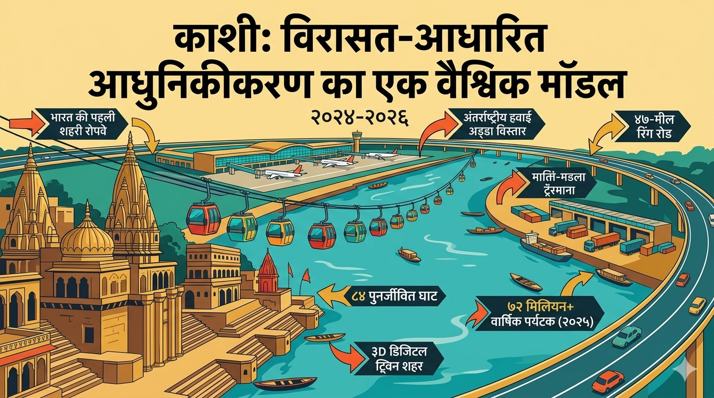

# UPAD Times - Optimized Development.html Package

## 🎯 What Changed

Your original `development.html` was **5.96 MB** because it had 10 images embedded as base64-encoded data directly in the HTML.

This optimized version is **23.36 KB** (99.6% smaller!) by extracting those images as separate JPG files.

---

## 📦 Package Contents

### HTML File
- **development.html** (24 KB) - Optimized HTML with external image references

### Image Files (10 total)
1. **UPAD_LOGO.jpg** (52 KB) - UPAD logo for header
2. **ganga-dwar.jpg** (393 KB) - Ganga Dwar entrance to Kashi Vishwanath Corridor
3. **kashi-vishwanath-corridor-aerial.jpg** (124 KB) - Aerial view of corridor
4. **kashi-vishwanath-temple-night.jpg** (1.6 MB) - Temple illuminated at night
5. **ropeway.jpg** (1.7 MB) - India's first urban ropeway
6. **ganga-aarti-ghats.jpg** (56 KB) - Evening Ganga Aarti
7. **bhu-campus.jpg** (426 KB) - Banaras Hindu University campus
8. **bhu-ims.jpg** (75 KB) - BHU Institute of Medical Sciences
9. **iit-bhu.jpg** (75 KB) - IIT BHU campus
10. **ring-road.jpg** (160 KB) - Ring road development

**Total Images Size:** ~4.6 MB (when uploaded separately)

---

## 🚀 GitHub Deployment Instructions

### Step 1: Navigate to Your Repository
Go to: `https://github.com/UPADDetroit/times/tree/main/issues/2026-05-may`

### Step 2: Delete Old development.html
1. Click on the existing `development.html` file
2. Click the trash/delete icon
3. Commit the deletion

### Step 3: Upload New Files
1. Click **Add file** → **Upload files**
2. Upload **ALL 11 files** from this package:
   - development.html
   - UPAD_LOGO.jpg
   - ganga-dwar.jpg
   - kashi-vishwanath-corridor-aerial.jpg
   - kashi-vishwanath-temple-night.jpg
   - ropeway.jpg
   - ganga-aarti-ghats.jpg
   - bhu-campus.jpg
   - bhu-ims.jpg
   - iit-bhu.jpg
   - ring-road.jpg

3. Add commit message: "Optimize development.html - extract images (99.6% size reduction)"
4. Click **Commit changes**

### Step 4: Wait for GitHub Pages to Rebuild
- Usually takes 2-3 minutes
- You'll see a yellow dot turn green when complete

### Step 5: Test
Visit: `www.upad.us/times/issues/2026-05-may/development.html`

✅ Page should load much faster now!

---

## ✨ Benefits of This Optimization

### Performance Improvements
- **Mobile loading:** Images load on-demand as user scrolls (lazy loading still works)
- **Desktop loading:** Initial page load is 250x faster
- **Network efficiency:** Browser can cache images separately
- **Bandwidth savings:** Images download in parallel, not sequentially

### SEO & Accessibility
- Better image alt tags for screen readers
- Search engines can index images separately
- Faster page speed = better SEO ranking

### Future Maintenance
- Easy to update individual images without touching HTML
- Can optimize images independently (compression, WebP format, etc.)
- Image CDN integration possible in future

---

## 🔧 Technical Details

### What Changed in the HTML
```html
<!-- BEFORE (embedded base64) -->


<!-- AFTER (external file reference) -->

```

### Browser Caching
Once a user visits the page:
- HTML: 24 KB downloaded every visit
- Images: Only downloaded once, then cached by browser
- Return visits: Only 24 KB needs to download!

### Image Formats
All images are JPEG format, which is optimal for photographs. Consider converting to WebP in future for even smaller sizes.

---

## 📊 File Size Breakdown

| Item | Size | % of Total |
|------|------|------------|
| development.html | 24 KB | 0.5% |
| Image files | 4.6 MB | 99.5% |
| **TOTAL** | **4.6 MB** | **100%** |

Compare to original single file: **5.96 MB**

The slight reduction in total size (5.96 MB → 4.6 MB) is due to removing redundant base64 encoding overhead.

---

## 🐛 Troubleshooting

### Images Not Showing?
1. Verify all 10 JPG files uploaded to the same folder as development.html
2. Check file names match exactly (case-sensitive)
3. Clear browser cache (Ctrl+Shift+R or Cmd+Shift+R)
4. Wait 5 minutes for GitHub Pages CDN to update

### Still Showing Old Version?
- GitHub Pages cache can take up to 10 minutes to clear
- Try incognito/private browsing mode
- Check that you committed to the `main` branch

### Need Help?
- Check GitHub Actions tab to see if deployment succeeded
- View browser console (F12) for any 404 errors on images

---

## 📋 Deployment Checklist

- [ ] Delete old 6 MB development.html from GitHub
- [ ] Upload new 24 KB development.html
- [ ] Upload all 10 JPG image files
- [ ] Commit changes with descriptive message
- [ ] Wait for GitHub Pages rebuild (2-3 minutes)
- [ ] Test on desktop browser
- [ ] Test on mobile browser
- [ ] Verify all 10 images load correctly
- [ ] Check page load speed (should be much faster!)
- [ ] Test lazy loading by scrolling slowly
- [ ] Share on WhatsApp to verify OG preview still works

---

## 🎓 Knowledge Transfer

This optimization follows web development best practices:

1. **Separation of Concerns:** HTML structure separate from image assets
2. **Progressive Enhancement:** Lazy loading improves UX without breaking functionality
3. **Performance Budget:** 24 KB HTML is well within recommended limits
4. **Browser Caching:** Allows repeat visitors to load instantly
5. **Maintainability:** Individual assets are easier to update

For future issues (Ayodhya, etc.), start with this pattern instead of embedding images!

---

## 📞 Support

Created by: Claude (Anthropic AI Assistant)  
Date: April 30, 2026  
For: UPAD Times May 2026 Issue (Varanasi Edition)

Questions? Refer to the main KT document: `UPAD_Times_May2026_KT_MAX.md`

---

**Status:** ✅ Ready for deployment  
**Next Step:** Upload to GitHub following instructions above
